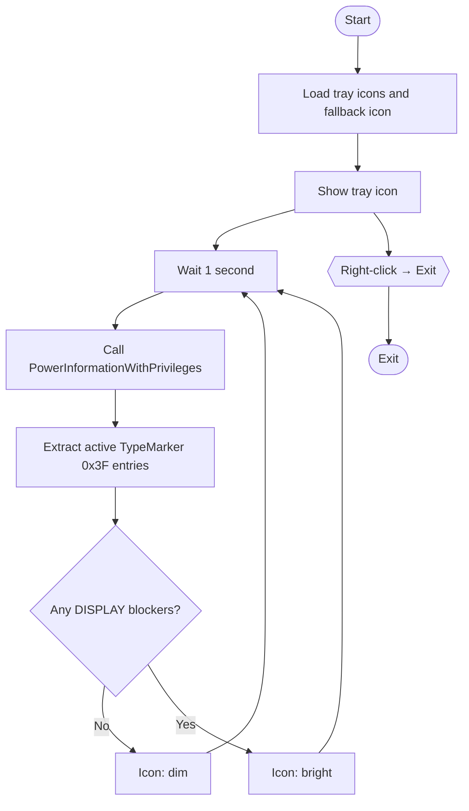

# WakeScope

Who's keeping your display awake? WakeScope finds out — every second.  
A system tray app that detects processes blocking Windows display sleep in real time.

[日本語版はこちら](README.md)

## Overview

Before Windows dims the display, it checks for active DISPLAY power requests.  
Browsers playing video and certain apps hold these requests indefinitely, preventing the screen from sleeping.  
WakeScope calls the Windows power request API directly every second and signals any culprits via tray icon color.

## Features

- Runs as a system tray icon with no visible window
- Monitors DISPLAY power requests every second
- Tray icon is bright when a blocker is detected (dim when none)
- Right-click menu shows process name, PID, and icon for each blocker
- Single-instance enforced via global Mutex

## Requirements

| Item | Requirement |
|------|-------------|
| OS | Windows 11 (x64) |
| Runtime | None (self-contained) |
| Privileges | **Administrator required** (needed for the power request API) |

## Installation

1. Download and extract the latest zip from the [Releases](https://github.com/130cmWolf/WakeScope/releases) page, or build from source
2. Right-click `WakeScope.exe` → **Run as administrator**

### Build from source

.NET 8 SDK is required.

```bash
git clone https://github.com/130cmWolf/WakeScope.git
cd WakeScope
dotnet publish -p:PublishProfile=Release
```

The output is placed at `publish\WakeScope.exe`.

## Usage

1. Run `WakeScope.exe` as administrator — a tray icon appears
2. Icon is dim when no blockers are found; turns bright when one or more are active
3. Right-click the tray icon to see the blocker list and the **Exit** option

## How it works

WakeScope calls `PowerInformationWithPrivileges` (level 45) in `powrprof.dll` every second to retrieve the system-wide power request list.  
Entries with TypeMarker `0x3F` and a non-zero active flag are extracted as DISPLAY blockers. Their NT paths are converted to Win32 paths to resolve process icons and PIDs.



## Verification

While playing YouTube in Chrome, run the following and confirm it matches WakeScope's display:

```
powercfg /requests
DISPLAY:
[PROCESS] \Device\HarddiskVolume3\...\chrome.exe
Video Wake Lock
```

## License

MIT — [130cmWolf](https://github.com/130cmWolf/WakeScope)
