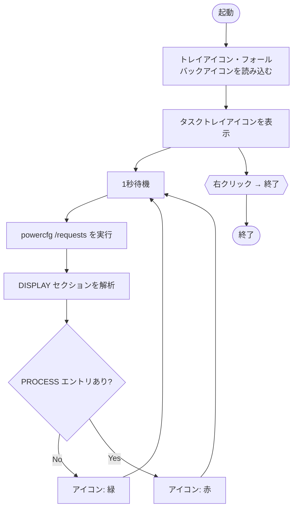

# WakeScope

「なぜスリープしない？」の犯人を1秒ごとに監視する、タスクトレイ常駐ツールです。  
DISPLAY 電力要求をブロックしているプロセスをリアルタイムで検出・表示します。

[English README](README-en.md)

## 概要

Windows はディスプレイのスリープ前に DISPLAY 電力要求の有無を確認します。  
動画再生中のブラウザや一部のアプリはこの要求を発行し続けるため、画面が眠れなくなります。  
WakeScope はその犯人を `powercfg /requests` 経由で1秒ごとに監視し、トレイアイコンの色で即座に知らせます。

## 機能

- タスクトレイに常駐し、UI を占有しない
- DISPLAY 電力要求を1秒ごとに自動監視
- ブロッカー検出時はトレイアイコンを赤に変化
- 右クリックメニューでプロセス名・PID・アイコンを一覧表示
- 多重起動防止（グローバル Mutex）

## 動作環境

| 項目 | 要件 |
|------|------|
| OS | Windows 11（x64） |
| ランタイム | .NET 8 Desktop Runtime |
| 権限 | **管理者権限が必要**（`powercfg /requests` の実行に必須） |

## インストール

1. [Releases](https://github.com/130cmWolf/WakeScope/releases) から最新の zip をダウンロードして展開する、または自分でビルドする
2. `WakeScope.exe` を `icons/` フォルダと同じ場所に配置する
3. `WakeScope.exe` を右クリック →「管理者として実行」

### 自分でビルドする場合

```bash
git clone https://github.com/130cmWolf/WakeScope.git
cd WakeScope
dotnet build -c Release
```

ビルド後、`icons/` フォルダに以下のアイコンを用意してください。

| ファイル | 用途 |
|----------|------|
| `icons/tray_idle.ico` | ブロッカーなし（緑） |
| `icons/tray_active.ico` | ブロッカーあり（赤） |

## 使い方

1. 管理者として `WakeScope.exe` を実行するとタスクトレイにアイコンが表示される
2. ブロッカーがなければ緑、1件以上あれば赤に変化する
3. 右クリックでブロッカーの一覧と「終了」メニューを表示する

## 仕組み

`powercfg /requests` の出力を1秒ごとにパースし、`DISPLAY:` セクションの `[PROCESS]` エントリを抽出します。  
プロセス名からアイコンを取得し、PID はプロセス名で絞り込んだうえで実行パスを照合して特定します。



## 動作確認

YouTube を Chrome で再生中に以下を実行し、WakeScope の表示と一致すれば正常です。

```
powercfg /requests
DISPLAY:
[PROCESS] \Device\HarddiskVolume3\...\chrome.exe
Video Wake Lock
```

## ライセンス

MIT — [130cmWolf](https://github.com/130cmWolf/WakeScope)
